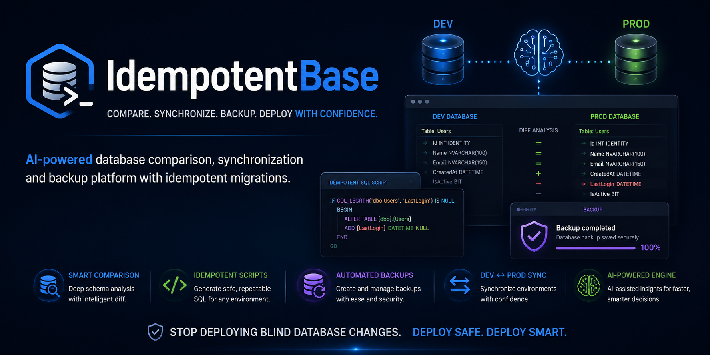
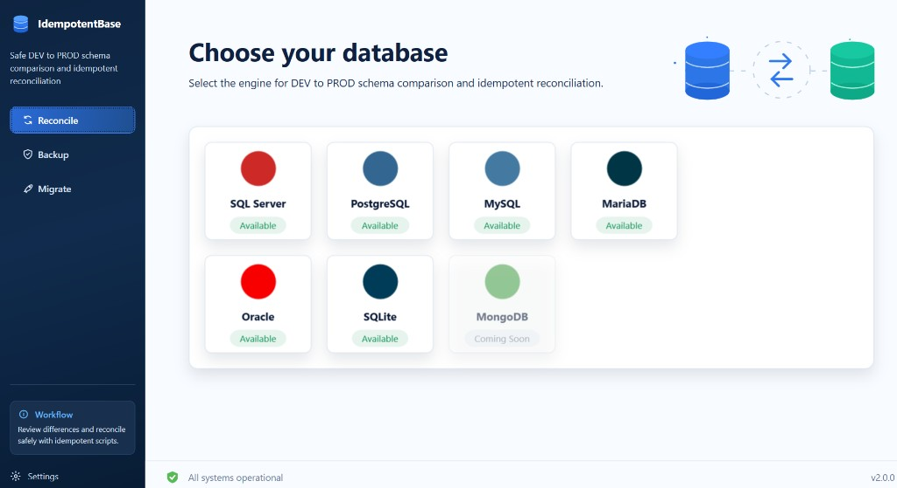
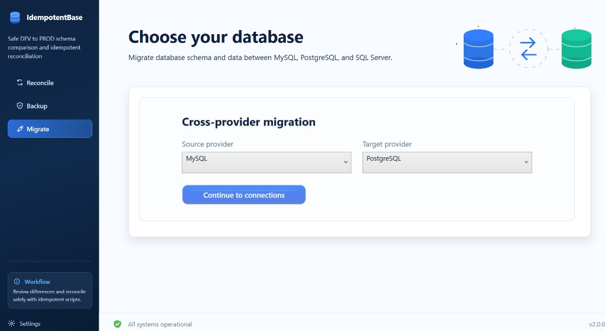

<p align="center">
  
</p>

<p align="center">
  <strong>US</strong> <a href="README.md">English</a> |
  <strong>BR</strong> <a href="README.pt-BR.md">Português</a>
</p>

<p align="center">
  <a href="https://github.com/Edinaldosa2/IdempotentBasePublic/releases"></a>
  <a href="LICENSE"></a>
  <a href="https://dotnet.microsoft.com/download/dotnet-framework/net48"></a>
  
  
  <a href="https://github.com/Edinaldosa2"></a>
</p>

# IdempotentBase

**Safe schema reconciliation, cross-provider migration and database backup for Windows — built for DBAs and DevOps teams.**

IdempotentBase is a **.NET / WPF** desktop tool for **database schema comparison**, **idempotent SQL script generation**, **DEV ↔ PROD synchronization**, **cross-provider migration**, and **native SQL Server backup** — without destructive surprises.

Compare SQL Server, PostgreSQL, MySQL, MariaDB, and Oracle schemas. Generate safe, repeatable migration scripts. Export cross-provider DDL and batched INSERT scripts. Protect production with a built-in safety model designed for real-world DBA workflows.

---

## Screenshots

### Choose your database (Reconcile)

Pick a database engine from the provider grid. The sidebar lets you switch between **Reconcile**, **Backup**, and **Migrate** without restarting the app.

<p align="center">
  
</p>

### Cross-provider migration (Migrate)

Select source and target providers (MySQL, PostgreSQL, SQL Server, and more), then continue to connection setup for schema and data export.

<p align="center">
  
</p>

---

## What's New in v1.0.2

| Area | Update |
|------|--------|
| **Desktop shell** | Sidebar navigation with dedicated **Reconcile**, **Backup**, and **Migrate** workflows |
| **Provider selection** | Refreshed database cards with **Available** / **Coming Soon** status badges |
| **UI styling** | Card-based page layout, glassmorphism action buttons, and consistent workflow views |
| **MySQL** | Fixed routine parameter scan — no longer queries `PARAMETER_DEFAULT` on unsupported servers |
| **Migrate** | Cross-provider schema DDL generation, batched INSERT export, and SQL-only review mode |

---

## Table of Contents

- [Screenshots](#screenshots)
- [What's New in v1.0.2](#whats-new-in-v102)
- [Download and Run](#download-and-run)
- [Clone from Git](#clone-from-git)
- [First Connection](#first-connection)
- [Workflows](#workflows)
- [Supported Providers](#supported-providers)
- [Key Features](#key-features)
- [Safety Model](#safety-model)
- [Requirements](#requirements)
- [Reconciliation Workflow](#reconciliation-workflow)
- [Migration Workflow](#migration-workflow)
- [Backup Workflow](#backup-workflow)
- [Connection Storage](#connection-storage)
- [Repository Layout](#repository-layout)
- [Releases](#releases)
- [Documentation](#documentation)
- [License](#license)

---

## Download and Run

1. Install [.NET Framework 4.8](https://dotnet.microsoft.com/download/dotnet-framework/net48) if it is not already on your machine.
2. Download **IdempotentBase-v1.0.2-win-x64.zip** from [GitHub Releases](https://github.com/Edinaldosa2/IdempotentBasePublic/releases).
3. Extract the ZIP anywhere (for example `C:\Tools\IdempotentBase\`).
4. Run the application:

```powershell
.\app\IdempotentBase.exe
```

The ZIP includes the executable, dependencies, documentation, and connection samples — everything needed to run the app.

---

## Clone from Git

```powershell
git clone https://github.com/Edinaldosa2/IdempotentBasePublic.git
cd IdempotentBasePublic
.\app\IdempotentBase.exe
```

No build step is required. The `app/` folder contains the ready-to-run distribution.

---

## First Connection

**Option A — Use the UI (recommended)**

1. Launch `app\IdempotentBase.exe`.
2. Choose your database engine on the home screen.
3. Fill in host, port, database, and credentials.
4. Check **Save connection** to persist settings locally.

**Option B — Start from a sample file**

```powershell
Copy-Item database\sqlserver\connections.sample.json database\sqlserver\connections.json
```

Replace placeholder values in `connections.json`. Sample files contain no real credentials.

---

## Workflows

Use the **sidebar** to switch workflows at any time. Each workflow shows contextual help in the sidebar footer.

| Workflow | Purpose |
|----------|---------|
| **Reconcile** | Compare DEV vs PROD schemas on the same engine, generate idempotent scripts, export reports, apply safe changes |
| **Backup** | Connect to a single SQL Server database and run a native `BACKUP DATABASE` |
| **Migrate** | Move schema and data between different providers — pick source/target engines, generate DDL and batched INSERT scripts |

```
Sidebar: Reconcile | Backup | Migrate  →  Choose provider(s)  →  Connect  →  Compare / Export / Backup
```

---

## Supported Providers

| Provider | Connection | Schema scan & compare | Script generate & apply | Cross-provider migrate | Backup |
|----------|:----------:|:---------------------:|:-----------------------:|:----------------------:|:------:|
| SQL Server | Yes | Yes | Yes | Yes | Yes |
| PostgreSQL | Yes | Yes | Yes | Yes | Planned |
| MySQL | Yes | Yes | Yes | Yes | Planned |
| MariaDB | Yes | Yes | Yes | Yes | Planned |
| Oracle | Yes | Yes | Yes | Yes | Planned |
| SQLite | Yes | Coming Soon | Coming Soon | Planned | Planned |
| MongoDB | Coming Soon | Coming Soon | Coming Soon | N/A | N/A |

MariaDB reuses the MySQL provider stack internally.

---

## Key Features

### Desktop shell (v1.0.2)

- **Sidebar navigation** — switch between Reconcile, Backup, and Migrate from any screen
- **Provider cards** — visual grid with per-engine logos and **Available** / **Coming Soon** badges
- **Card-based layout** — consistent page structure across connection, scan, and result views
- **Glassmorphism buttons** — modern primary actions with clear visual hierarchy
- **Workflow hints** — sidebar footer explains the active workflow goal

### Schema reconciliation

- Compare tables, columns, keys, indexes, constraints, views, procedures, functions, triggers, and sequences
- Safety classification: `SAFE_AUTO`, `REVIEW_REQUIRED`, `DESTRUCTIVE_BLOCKED`, `INFO_ONLY`
- Idempotent script generation per dialect
- Export Markdown, HTML, and JSON reports
- Metadata read warnings surfaced during scan

### Cross-provider migration (v1.0.1)

- **Migrate** workflow on the home screen
- Cross-provider type mapping and target DDL generation
- Batched data export with INSERT script generation
- SQL-only export mode for manual review before execution

### Database backup (SQL Server)

- Native `BACKUP DATABASE TO DISK`
- Configurable output folder with **Browse** picker
- Optional compression with auto-fallback

### Professional connections

- DBeaver-style panels per engine with SSL/encrypt options
- Connection string preview with masked passwords
- Per-provider connection storage under `database/{provider}/`

---

## Safety Model

IdempotentBase is **not** a destructive synchronization tool.

| Rule | Behavior |
|------|----------|
| No silent drops | `DROP TABLE`, `DROP COLUMN`, and similar patterns are blocked |
| No shrink operations | Column size reductions are never auto-applied |
| Classification first | Every difference receives a safety label before scripting |
| Script analysis | Generated SQL is scanned for forbidden patterns |
| Apply gate | PROD apply requires tested connection, backup confirmation, and typed database name |

**Always take a verified backup before applying any script to production.**

See [docs/safety-rules.md](docs/safety-rules.md) for the full rule set.

---

## Requirements

| Component | Version |
|-----------|---------|
| OS | Windows 10 or later |
| Runtime | [.NET Framework 4.8](https://dotnet.microsoft.com/download/dotnet-framework/net48) |
| Databases | SQL Server, PostgreSQL, MySQL, or Oracle instance for testing |

All database drivers are bundled with the application.

---

## Reconciliation Workflow

1. Open the app → choose your database engine.
2. Select **Reconcile** in the workflow switcher.
3. Configure **DEV (Source)** and **PROD (Target)** connections.
4. Click **Connect DEV** and **Connect PROD**.
5. Click **Compare Databases** → review results.
6. **Generate Idempotent Script** → save or apply (after backup confirmation).

---

## Migration Workflow

1. Open the app → choose source and target database engines.
2. Select **Migrate** in the workflow switcher.
3. Configure source and target connections.
4. Run schema analysis and review generated target DDL.
5. Export batched INSERT scripts or use SQL-only export mode for manual execution.

Cross-provider migration maps types and generates conservative DDL. Review all output before running against production.

---

## Backup Workflow

1. Choose **SQL Server** → select **Backup**.
2. Configure connection and backup folder.
3. Click **Connect** → **Run Backup**.
4. Confirm the `.bak` file path in the success dialog.

---

## Connection Storage

```
database/
  sqlserver/connections.json
  postgresql/connections.json
  mysql/connections.json
  ...
```

Samples (no secrets): [database/sqlserver/connections.sample.json](database/sqlserver/connections.sample.json)

`connections.json` files are local only and never committed to git.

---

## Repository Layout

```
IdempotentBasePublic/
├── app/          Executable, DLLs, assets, and embedded connection samples
├── database/     Connection samples (copy to connections.json locally)
├── docs/         Architecture, safety rules, metadata, roadmap
├── img/          Banner and project images
├── util/         Maintainer build scripts
└── releases/     Local ZIP output (not tracked in git)
```

---

## Releases

Official downloads: [GitHub Releases](https://github.com/Edinaldosa2/IdempotentBasePublic/releases)

| Version | Package | Highlights |
|---------|---------|------------|
| v1.0.2 | `IdempotentBase-v1.0.2-win-x64.zip` | Desktop shell with sidebar, provider cards, UI refresh, MySQL parameter scan fix |
| v1.0.1 | `IdempotentBase-v1.0.1-win-x64.zip` | Cross-provider Migrate workflow, MySQL catalog fixes |
| v1.0.0 | `IdempotentBase-v1.0.0-win-x64.zip` | Initial public release |

To rebuild or publish, see [util/README.md](util/README.md).

---

## Documentation

| Document | Description |
|----------|-------------|
| [docs/architecture.md](docs/architecture.md) | Multi-provider design, data flow, extension points |
| [docs/safety-rules.md](docs/safety-rules.md) | Classification rules and blocked operations |
| [docs/sqlserver-metadata.md](docs/sqlserver-metadata.md) | SQL Server catalog coverage |
| [docs/roadmap.md](docs/roadmap.md) | Planned features |

---

## License

MIT License. See [LICENSE](LICENSE).

---

## Author

[Edinaldosa2](https://github.com/Edinaldosa2)

IdempotentBase is a **safe schema reconciliation assistant**. It helps you understand drift, generate conservative SQL, and protect production — not replace your DBA judgment.
