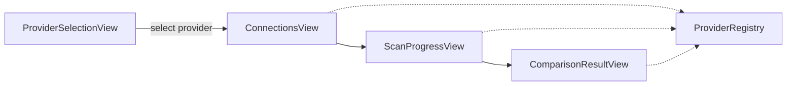

# Architecture

## Overview

IdempotentBase follows a layered, multi-provider architecture designed for safety, testability, and clear separation of concerns. The desktop app starts with a **provider selection** screen, then routes all scan/compare/script workflows through the active provider module.

## Projects

| Project | Target | Responsibility |
|---------|--------|----------------|
| IdempotentBase.Core | .NET Standard 2.0 | Domain models, enums, safety rules, interfaces, shared `SnapshotSchemaComparer` |
| IdempotentBase.SqlServer | .NET Framework 4.8 | SQL Server metadata, scripting, connection adapter |
| IdempotentBase.PostgreSQL | .NET Framework 4.8 | PostgreSQL metadata, scripting, connection adapter (`Npgsql`) |
| IdempotentBase.MySql | .NET Framework 4.8 | MySQL/MariaDB metadata, scripting, connection adapter (`MySqlConnector`) |
| IdempotentBase.Oracle | .NET Framework 4.8 | Oracle metadata, scripting, connection adapter (`Oracle.ManagedDataAccess.Core`) |
| IdempotentBase.Sqlite | .NET Framework 4.8 | SQLite connection adapter; scan/script stubs (Coming Soon) |
| IdempotentBase.MongoDB | .NET Framework 4.8 | MongoDB stub module (Coming Soon) |
| IdempotentBase.Reporting | .NET Framework 4.8 | Markdown, HTML, JSON exporters |
| IdempotentBase.Desktop | .NET Framework 4.8 WPF | MVVM UI, navigation, provider registry, user workflows |
| IdempotentBase.Tests | .NET Framework 4.8 | Unit tests with snapshot fixtures |

## Multi-Provider Flow



1. **Provider selection** — User picks SQL Server, PostgreSQL, MySQL, MariaDB, Oracle, SQLite, or MongoDB.
2. **Connections** — Provider-specific connection panels build connection strings through `IProviderConnectionAdapter`.
3. **Scan** — Active module `IDatabaseMetadataReader` reads catalog metadata and builds `DatabaseSnapshot` objects.
4. **Compare** — Active module `ISchemaComparer` (or shared `SnapshotSchemaComparer`) compares DEV against PROD.
5. **Generate** — Active module `IReconciliationScriptGenerator` emits idempotent SQL for `SAFE_AUTO` differences.
6. **Analyze** — Active module `IScriptSafetyAnalyzer` scans for forbidden patterns.
7. **Apply** — Active module `ISqlScriptExecutor` runs the script inside a transaction with audit history.
8. **Report** — Exporters produce Markdown, HTML, or JSON artifacts.

## Provider Module Contract

Each provider implements `IDatabaseProviderModule`:

- `ConnectionTester`, `ConnectionAdapter`
- `MetadataReader`, `SchemaComparer`
- `ScriptGenerator`, `SafetyAnalyzer`, `ScriptExecutor`
- `Capabilities` and `Status` (`Available` / `Coming Soon`)

The desktop `ProviderRegistry` registers all modules at startup. `AppSessionState` stores `SelectedProvider` and `ActiveModule`.

## Connection Storage

Saved connections are stored per provider under:

```
database/{provider}/connections.json
```

Examples live in `database/{provider}/connections.sample.json`.

## Provider Status

| Provider | Connection | Scan / Compare / Script |
|----------|------------|-------------------------|
| SQL Server | Available | Full parity |
| PostgreSQL | Available | Full parity |
| MySQL | Available | Full parity |
| MariaDB | Available | Full parity (reuses MySQL stack) |
| Oracle | Available | Full parity |
| SQLite | Available | Coming Soon (scan blocked in UI) |
| MongoDB | Coming Soon | Stub only |

## Key Design Decisions

- DEV is always the source of truth; PROD is always the target.
- SQL Server reads from `sys.*` catalog views with version-aware table queries.
- PostgreSQL, MySQL, and Oracle use native catalog/dictionary queries per dialect.
- SQL module comparison uses normalized definition hashes.
- Destructive operations are blocked at comparison, generation, analysis, and UI confirmation layers.

## Extension Points

- `IDatabaseProviderModule` — plug-in provider packages
- `IDatabaseMetadataReader` — alternate database providers
- `ISchemaComparer` — custom comparison policies
- `IReconciliationScriptGenerator` — custom script dialects
- `IProviderConnectionAdapter` — provider-specific connection UI and string building
- `IReportExporter` — additional export formats
